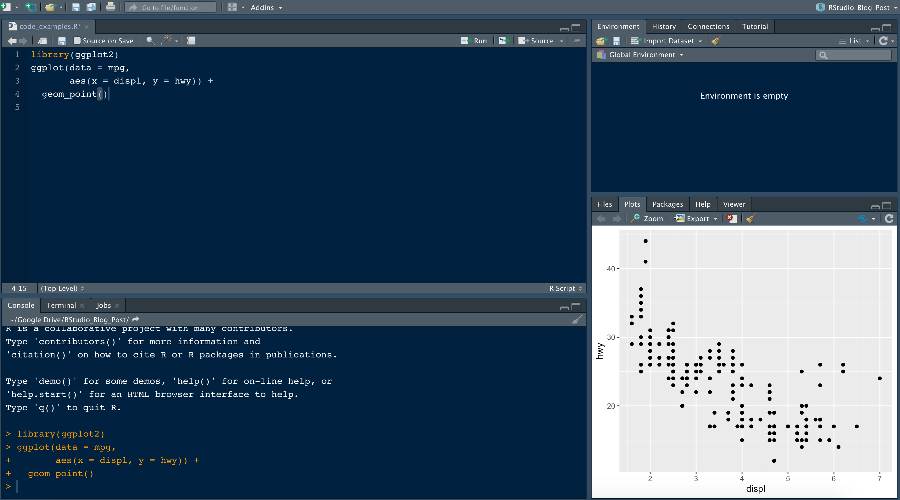

--- 
title: "R Course"
author: "YOUR NAME HERE"
date: "`r Sys.Date()`"
site: bookdown::bookdown_site
---
# R - Introduction

<script src="js/dcl.js"></script>
<link rel="stylesheet" href="https://maxcdn.bootstrapcdn.com/bootstrap/3.4.1/css/bootstrap.min.css">
<script src="https://maxcdn.bootstrapcdn.com/bootstrap/3.4.1/js/bootstrap.min.js"></script>

<script src="js/dcl.js"></script>
```{r include=FALSE}
tutorial::go_interactive(greedy=TRUE)
knitr::opts_chunk$set(echo = TRUE,error=TRUE)
```


## R - Basic Concepts and applications 
**R (programming language)** is a language and environment for statistical computing and graphics 

## Why R? 

1. **Developed by Statisticians** - R is Excellent for Statistical Computing and Analysis 
2. **Open-source (Free)** - R is an open-source programming language. Anyone can work with R without any license or fee. Due to this, R has a huge community that contributes to its environment. 
3. **A Large Variety of Specialized Libraries** - These libraries support and enhance the R development environment.
4. **R Studio** - A graphic user interface to R - easier to grasp and learn. 
5. **Cross-platform Support** - R is machine-independent. It supports the cross-platform operation. Thus, it is usable on many different operating systems.
6. **Can do Data Cleansing, Data Wrangling, and Web Scraping** - R can collect data from the internet through web scraping and other means. It can also perform data cleansing. R is also useful for data wrangling which is the process of converting raw data into the desired format for easier consumption. 
7. **Powerful Graphics** - R has extensive libraries that can produce production quality graphs and visualizations. 
8. **Compatible with other Programming Languages** - R is compatible with other languages like C, C++, and FORTRAN. Other languages like .NET, Java, Python can also directly manipulate objects.
9. Compatible with high performance computing and Big Data Analytics. 

## R studio
**Rstudio** is an integrated development environment(IDE) for R. 

It includes a console, syntax-highlighting editor that supports direct code execution as well as tools for plotting history, debugging and work space management. 

R studio is an open source software from posit and can be freely be downloaded from https://posit.co/download/rstudio-desktop/. This link has all the installation files for Mac, Linux and Windows. You will download the installation file and install based on your computer operating system. 

### RStudio - Look and Feel



The image above is for R code in R Studio. Each quadrant has its own function. 

1. **text editor** 

serves as the primary interface for writing and editing R scripts, Markdown documents, and other text-based files

2. **stand input/output (console/terminal/jobs)**

It is the bottom left quadrant in R Studio that serves as a command-line interface where you can directly interact with R such as code execution and output display.

3. **all data and its properties quadrants**

It is the top right quadrant in Rstudio that is typically the "Environment" pane, which provides information and tools for managing your R environment such as data importation, display of variables. 


4. **plots and file directory structure**

The bottom right quadrant in RStudio typically houses the "Files", "Plots", "Packages", "Help", and "Viewer" tabs. 

## Basic Mathematics like operators 
### Basics
To do simple mathematical operations, the following operators are used;

1. `+` for addition

2. `-` for subtraction

3. `/` for division

4. `*` for multiplication 

The following examples will illustrates how to do simple arithmetic in R.

- **Example**
```{r}
2+3 # addition
```

<span style="color: green;">*Activity*</span>

- Your turn! Add `2398` to `4653`
```{r}
# Add 2398 to 4653 
## Code here
```

- **Example**
```{r}
6-2 #subtraction
```

<span style="color: green;">*Activity*</span>

- Your turn! Subtract `15` from `30`
```{r}
# Subtract 15 from 30
## Code here
```

- **Example**
```{r}
10 * 3 #multiplication
```

<span style="color: green;">*Activity*</span>

Your turn! Multiply `12` by `7` 
```{r}
# Multiply 12 by 7
## Code here
```

- **Example**
```{r}
30/15 # division
```

<span style="color: green;">*Activity*</span>

Your turn! Divide `27` by `3`
```{r}
# Divide 27 by 3
## Code here
```

Values can be assigned to variable names which will be instead of the values. For instance, in the example below, `30` is assigned to variable`m` and `15` is assigned to variable `n`.  The solution of their difference is assigned to variable `answer`. 
```{r}
m = 15
n = 30
answer = m - n
answer
```

<span style="color: green;">*Activity*</span>

Your turn! Assign `-5` to variable `m` and `20` to variable `n` and Add the two. Assign a variable `answer` to the sum of `m` and `n`. 
```{r}
m = -5
n = 20
answer = m + n
answer
```

### BODMAS rule
If there is are multiple different operators in a single expression then the BODMAS(Brackets, Orders (i.e., powers and square roots, etc.), Division and Multiplication, Addition and Subtraction) rule will apply when solving. 

**Basic BODMAS**
```{r}
answer = 5 + 2 * (10 - 4)
answer
```

The above expression is solved as follows;

- evaluate the brackets: `(10 - 4)` which is `6`,

- then, perform multiplication: `2 * 6` which is `12`,

- finally, addition: `5 + 12` which is `17`.

<span style="color: green;">*Activity*</span>

Workout the below three equations and find their solutions;
```
q1 = 2+3-9/3+4*21-(21+14)
q2 = 5-3*(10+2)+10/5
q3 = 9/3*(2+3)+4
```

Solve them here 
```{r}
#Workout the equations here
## Code here
```

**Including Exponentiation**
```{r}
answer = (6 + 4) ^ 2 - 3 * 5
answer
```

The above equation is solved as follows;

- evaluate the brackets: `(6 + 4)` which is `10`.

- then, perform exponentiation: `10 ^ 2` which is `100`.

- then, perform multiplication: `3 * 5` which is `15`.

- finally, subtraction: `100 - 15` which is `85`.

**More Complex and Interesting BODMAS**
```{r}
answer = (20 / 4) + 3^2 * (2 + 1) - 5
answer
```

The above expression is solved as follows;

- evaluate the brackets: `(20 / 4)` which is `5` and `(2 + 1)` which is `3`.
- perform exponentiation: `3^2` which is `9`.
- perform multiplication: `9 * 3` which is `27`.
- addition and subtraction in order: `5 + 27` which is `32`, and `32 - 5` which is `27`


NOTE: **These operators are only applicable for numerical variables.**

## R Markdown 
R Markdown is a versatile markup language that allows you to create dynamic documents that integrate text, code, and output. It is widely used in data analysis, scientific research, and reporting

The figure shows how markdown looks like 


Each chunk can be run separately in a single file, also the variable in one chunk can be reused by the next/later chunks 

Anything added outside the chuck will not be executed in the program

The R markdown can be knitted to a html, pdf, or word file and presented to the audience

## Installation of packages
R libraries/packages can be installed by invoking `install.packages("package_name")` to the console. The figure below shows how to install `expn` library. Alternatively, a package can be installed from the graphical user interface in R by clicking 'tools' tab then "install.packages". A dialogue box will appear requesting you to enter the name of the package to be installed. Thereafter, click the 'install' button on the dialogue box to install the package. 


## Assignment 
Use the guide above to;

i. Install R based on your computer operating system. 
ii. Install RStudio
iii. Open an R Markdown file in RStudio and work on the code challenge below. 

## CODE CHALLENGE 
You have to use Base R to solve the questions below;

1. If you have 3 apples and you buy 5 more apples. How many apples do you have in total?
2. You have 10 candies and you give away 4 candies. How many candies do you have in total? 
3. Each pen costs 2 US dollars. If you bought 7 pens, how much did you spend in total? 
4. Solve the following equations;
    a. `34 + 54`
    b. `76 - 10`
    c. `25 * 25`
    d. if `d=42` and `f=14` evaluate `d/f`

5. A rectangle has a length of 8 meters and width of 5 meters. What is the area of the rectangle. Use variables, `length`, `width` and `area` to find the solution. 
6. A car travels in a speed of 60km/hr. How far will it travel for 3 hours. 
7. Evaluate;
    a. `5 + 3 * 2`
    b. `(8 + 2) * (5 - 3)`
    c. `9 + (6 - 2) * 3`
    d. `8 * 3 - 2^2`
    e. `(10 + 5) * (2^2) / 4`

8. You have `g` liters of juice. You want to pour the juice equally into the `h` bottles. How much juice will each bottle contain? `g=12`, `h=13`.

9.You have `b` rupees and spend 8 rupees on a book. How much money do you have left? 

10. Evaluate `m=5 * (4 + 6) - 10` and print out `m` to the console. 